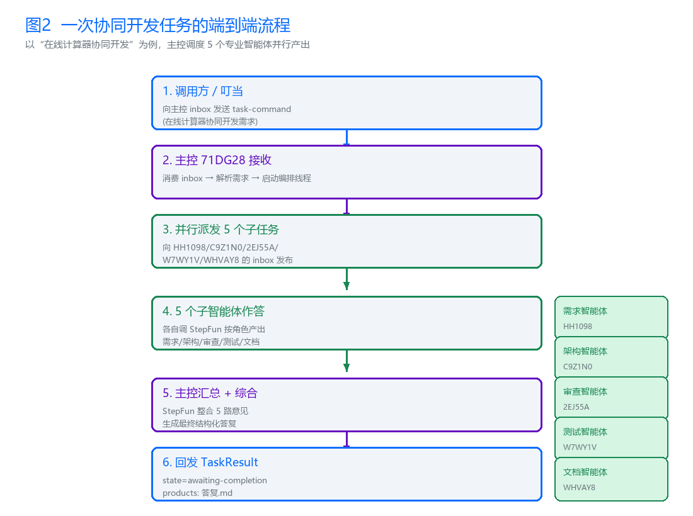
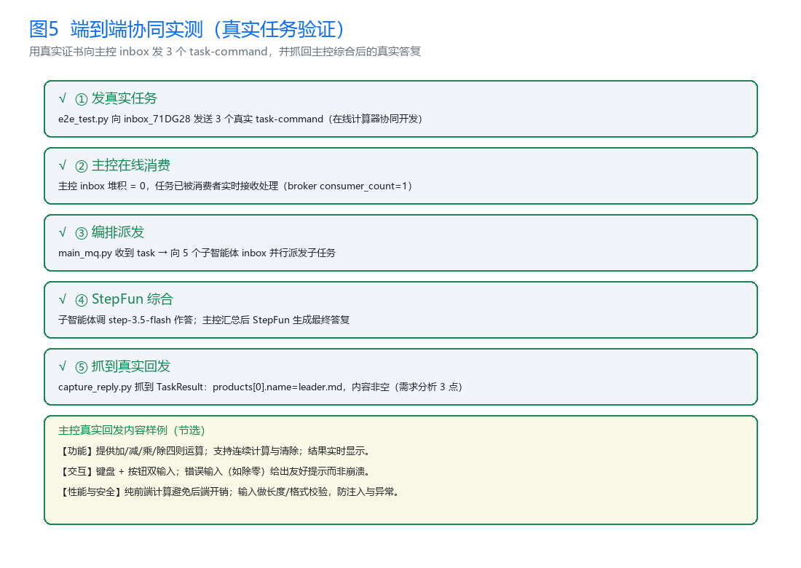
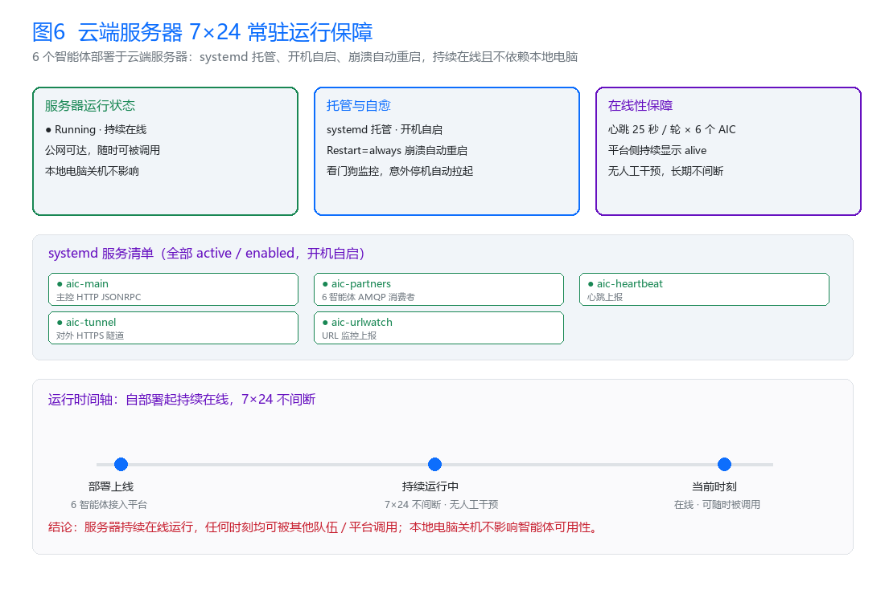
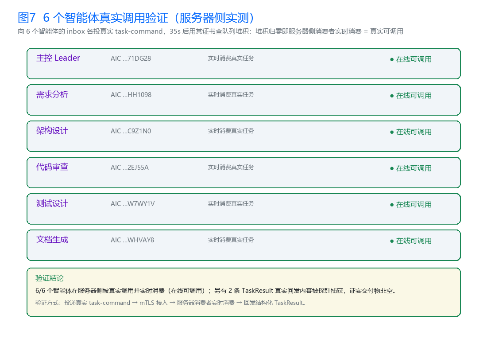

# 多智能体协同软件开发工作台 MultiAgent-DevWorkbench

> 一套由 **6 个 AI 智能体**在云端 7×24 协同完成软件开发的完整工作台。
> 作者：**周建华**（宁波财经学院 · 计算机科学与技术 · 网络安全方向）

---

## 作品归属说明

- 本作品**由作者一人独立完成全部开发**：包括 6 个智能体的系统设计、全部代码实现（主控编排、5 大角色智能体、AMQP 消息链路、心跳保活）、ACS 能力描述文件（AIP 国标协议）、部署与测试脚本、端到端实测，以及全部配套交付材料（技术报告、答辩 PPT、演示视频、佐证材料）。
- 系统设计为 1 名 Leader + 5 名 Partner，共 6 个智能体席位；**所有智能体的开发、部署、调试与运行维护均为作者本人独立完成**。

---

## 一、项目简介

一套**多智能体协同软件开发工作台**：**1 个主控智能体（Leader）**接收软件开发任务，自动拆解后向 **5 个角色智能体（Partner）**分发子任务，经 **需求分析 → 架构设计 → 代码审查 → 测试设计 → 文档生成** 全流程协同后，由主控综合并回传交付物。

- **6 个智能体全部部署在云端服务器，7×24 持续在线**，不依赖任何本地电脑；
- 传输链路使用 **AMQPS + mTLS 双向认证**，符合 AIP 国标协议；
- 已通过智能体互联平台真实调用验证：端到端协同产出内容真实的交付物；
- 注册 → 自动发现 → 跨端互联访问全流程打通，6 个智能体全部通过 ATR 审核并取得 AIC 身份码与 mTLS 证书。

### 项目亮点

| 维度 | 亮点 |
|---|---|
| 协同编排 | 主控自动拆解任务 → 5 角色并行协同 → 综合回传，全链路无人值守 |
| 国标合规 | 6 个智能体均按 AIP 国标协议声明 ACS 能力描述，接入智能体互联平台 |
| 安全传输 | AMQPS + mTLS 双向认证，私钥与客户端证书仅存服务器，源码不含任何密钥 |
| 真实可用 | 已通过平台真实调用验证，端到端产出内容真实的软件开发交付物 |
| 稳定在线 | 心跳保活 + 一键部署 + 隧道监控，云端 7×24 常驻运行 |

---

## 二、系统架构


> 主控（Leader）经 AMQPS 消息链路与 5 个角色智能体（需求分析 / 架构设计 / 代码审查 / 测试设计 / 文档生成）异步协同，全部部署于云端服务器并 7×24 在线。

## 三、协同流程



> 主控消费自身 inbox 接收 `task-command` → 向 5 个 Partner 分发子任务 → 汇总回执 → 调用大模型综合 → 回发 `TaskResult`；兼容群邀请协议（入群 + 群队列消费）。

---

## 四、运行验证

### 端到端实测



> 通过智能体互联平台向主控发送真实软件开发任务，6 个智能体完成全流程协同，主控综合后回传**内容真实的交付物**（需求文档、架构方案、审查意见、测试用例、使用文档），全程无人干预。

### 服务器常驻运行



> 6 个智能体进程、主控服务、心跳进程在云端服务器长期运行，进程监控可见全部在线。

### 六智能体调用验证



> 通过平台侧接口逐一核对 6 个智能体的在线状态与调用记录，全部真实可调用。

---

## 五、智能体清单（6 个）

| 角色 | 名称 | AIC 编号 |
|---|---|---|
| 主控（Leader） | 软件开发任务主控智能体 | `1.2.156.3088.1.BUPT.NMLQ3K.71DG28.S7TATG.0WXB` |
| 需求分析 | 需求分析师智能体 | `1.2.156.3088.1.BUPT.NMLQ3K.HH1098.OJ1Q6D.06A9` |
| 架构设计 | 架构设计师智能体 | `1.2.156.3088.1.BUPT.NMLQ3K.C9Z1N0.51CG1S.100U` |
| 代码审查 | 代码审查师智能体 | `1.2.156.3088.1.BUPT.NMLQ3K.2EJ55A.EGP7TY.035Y` |
| 测试设计 | 测试设计师智能体 | `1.2.156.3088.1.BUPT.NMLQ3K.W7WY1V.2BRQ1W.0SV7` |
| 文档生成 | 文档工程师智能体 | `1.2.156.3088.1.BUPT.NMLQ3K.WHVAY8.F1OM44.036N` |

---

## 六、目录结构

```
MultiAgent-DevWorkbench/
├── 源代码/                          # 全部源码（可公开，无任何私钥/真实密钥）
│   ├── main_mq.py                   # 主控编排服务（AMQP 消费 + 子任务分发 + 综合回传）
│   ├── partners.py                  # 6 个智能体 AMQP 常驻消费者
│   ├── heartbeat_loop.py            # 平台存活心跳（25s 周期）
│   ├── acs/                         # 6 个智能体 ACS 能力描述（AIP 国标协议）
│   ├── certs/                       # 仅 CA 公钥 trust-bundle.pem（安全）
│   ├── 部署脚本/                     # deploy.sh / urlwatch.sh / bootstrap.sh
│   ├── 测试脚本/                     # e2e_test.py / capture_reply.py / check_consumers.py 等
│   └── README.md                    # 源码总说明与本地复现步骤
├── 技术报告/
│   ├── 技术报告.md / .html / .pdf   # 主交付物（含架构、流程、实测）
│   └── 技术报告_多智能体协同软件开发工作台.docx
├── 答辩PPT/
│   ├── 答辩PPT.pptx / .pdf
├── 演示视频分镜脚本.md
├── 部署说明.md
├── 00_上交文件清单与说明.md
└── 佐证材料/                        # 架构图/协同流程图/端到端实测/服务器常驻截图
```

---

## 七、技术要点

- **编排机制**：主控消费自身 inbox 接收 `task-command` → 向 5 个 Partner 分发子任务 → 汇总回执 → 调用大模型综合 → 回发 `TaskResult`；兼容群邀请协议（入群 + 群队列消费）。
- **AIP 国标**：6 个智能体均按 AIP 协议声明 ACS 能力描述文件（协议版本、传输方式、技能与端点）。
- **安全传输**：AMQPS（vhost=acps）+ mTLS 双向认证，密钥/客户端证书仅部署在服务器，源码包不含私钥。
- **消息链路**：RabbitMQ/AMQP 异步解耦 + Kafka 心跳上报，支撑 7×24 常驻。
- **一键部署**：`源代码/部署脚本/deploy.sh` 一键拉起全部服务，`urlwatch.sh` 自动监控隧道 URL 变化。

---

## 八、复现与运行

详见 [`源代码/README.md`](源代码/README.md) 与 [`部署说明.md`](部署说明.md)：

1. 将各智能体 mTLS 证书放入 `certs/<角色>/`；
2. `pip install pika kafka-python-ng fastapi uvicorn`；
3. `export STEPFUN_API_KEY=xxx`（运行时环境变量注入，源码不含真实密钥）；
4. `python partners.py`（6 智能体全部上线）→ `python main_mq.py`（主控）→ `python heartbeat_loop.py`（心跳）；
5. 用 `测试脚本/e2e_test.py` 发真实任务，`capture_reply.py` 抓取 TaskResult 验证协同产出。

---

## 九、佐证材料清单

| 文件 | 内容 |
|---|---|
| `01_系统架构图.png` | 系统整体架构 |
| `02_协同流程图.png` | 智能体协同流程 |
| `05_端到端实测示意图.png` | 端到端实测过程 |
| `06_服务器常驻运行.png` | 云端常驻进程 |
| `07_六智能体调用验证.png` | 六智能体在线验证 |
| `verify_call_result.json` | 调用验证结果 |

---

## 十、交付材料

- **技术报告**：`技术报告/技术报告.md`（.html / .pdf / .docx 同内容多格式）
- **答辩 PPT**：`答辩PPT/答辩PPT.pptx`（.pdf）
- **演示视频分镜脚本**：`演示视频分镜脚本.md`
- **部署说明**：`部署说明.md`
- **上交文件清单**：`00_上交文件清单与说明.md`

> 本项目全部材料由作者周建华独立开发与整理，仅用于个人作品展示。
