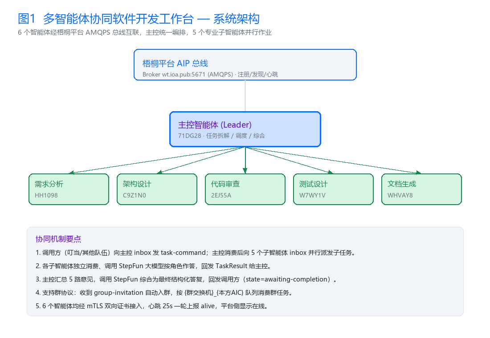

# 多智能体协同软件开发工作台 — 源代码总说明

团队码：**NMLQ3K**（根 OID：`1.2.156.3088.1.BUPT`）
作品名称：多智能体协同软件开发工作台
竞赛：第八届全球校园人工智能算法精英大赛 · 算法主题赛（智能体互联）
作者：**周建华**（本作品全部代码、部署、测试均为作者一人独立完成）

---

## 一、系统架构



```
                         ┌──────────────────────────────────────────────┐
                         │              云端服务器（7×24 常驻）            │
                         │                                              │
  外部调用方 ──task-command──▶ 主控智能体(main_mq.py)                    │
     │                        │  ├─ 拆解任务 → 分发子任务                 │
     │                        │  └─ 汇总回执 → 大模型综合 → TaskResult ◀──┘
     │                        ▼                                          │
     │              ┌───────────────────────────┐                       │
     │              │  5 个角色智能体(partners.py) │                     │
     │              │ 需求分析 · 架构设计 · 代码审查 │                     │
     │              │ 测试设计 · 文档生成           │                     │
     │              └─────────────┬─────────────┘                       │
     │                            │ AMQPS + mTLS 双向认证                │
     └────────────────────────────┴─────────────────────────────────────┘
```

- 消息总线：**RabbitMQ/AMQP**（broker `wt.ioa.pub:5671`，vhost=acps，mTLS）
- 心跳总线：**Kafka**（`wt.ioa.pub:19092`，`amp.heartbeat` 每 25s 上报）

## 二、智能体清单（6 个，全部部署在云端服务器并 7×24 持续在线）

| 角色 | 名称 | AIC 编号 |
|---|---|---|
| 主控（Leader） | 软件开发任务主控智能体 | `1.2.156.3088.1.BUPT.NMLQ3K.71DG28.S7TATG.0WXB` |
| 需求分析 | 需求分析师智能体 | `1.2.156.3088.1.BUPT.NMLQ3K.HH1098.OJ1Q6D.06A9` |
| 架构设计 | 架构设计师智能体 | `1.2.156.3088.1.BUPT.NMLQ3K.C9Z1N0.51CG1S.100U` |
| 代码审查 | 代码审查师智能体 | `1.2.156.3088.1.BUPT.NMLQ3K.2EJ55A.EGP7TY.035Y` |
| 测试设计 | 测试设计师智能体 | `1.2.156.3088.1.BUPT.NMLQ3K.W7WY1V.2BRQ1W.0SV7` |
| 文档生成 | 文档工程师智能体 | `1.2.156.3088.1.BUPT.NMLQ3K.WHVAY8.F1OM44.036N` |

## 三、消息协同时序

```
调用方                主控(Leader)                Partner×5
   │  task-command       │                          │
   ├─────────────────────▶ 拆解子任务                │
   │                     ├────────── task-command ──▶ 各角色作答
   │                     │◀────────── TaskResult ───┤
   │                     │  汇总回执                 │
   │                     │  调用大模型综合            │
   │◀──── TaskResult ────┤                          │
   │                     └── 群邀请协议：入群 → 群队列消费 ──▶
```

## 四、文件说明

| 文件 | 作用 |
|---|---|
| `main_mq.py` | **主控编排服务**。消费自身 inbox 队列接收 task-command → 向 5 个 Partner 的 inbox 分发子任务 → 汇总回执 → 调用 StepFun 大模型综合 → 回发 TaskResult 给调用方。兼容群邀请（入群 + 群队列消费）。同时保留 HTTP `/health`、`/rpc` 双通道。 |
| `partners.py` | **6 个智能体 AMQP 常驻消费者**。每个智能体独立线程消费自己的 inbox 队列；收到 task-command 调用 StepFun 按角色作答并回发 TaskResult；收到 group-invitation 自动入群并按 AIP 群协议创建 `{群交换机}_{本方AIC}` 队列消费群任务。 |
| `heartbeat_loop.py` | **平台存活心跳**。每 25 秒向 `wt.ioa.pub:19092` 的 `amp.heartbeat` 上报 6 个智能体 alive，保证在梧桐平台/叮当显示为在线。 |
| `acs/` | 6 个智能体的 **ACS 能力描述文件**（AIP 国标协议），声明协议版本、传输方式、技能与端点。 |
| `certs/` | mTLS 证书目录。**仅含 CA 公钥 `trust-bundle.pem`**；各智能体私钥与客户端证书部署在服务器，不在本包内（安全）。 |
| `部署脚本/` | `deploy.sh`（一键部署）、`urlwatch.sh`（隧道 URL 监控）、`bootstrap.sh`（VM 初始化）。 |
| `测试脚本/` | 见下表。 |

### 测试脚本清单

| 脚本 | 用途 |
|---|---|
| `e2e_test.py` | 端到端发真实任务实测（向主控 inbox 发送 task-command） |
| `capture_reply.py` | 抓取主控综合回发，验证协同产出真实内容 |
| `check_consumers.py` | 连接 broker 查各 inbox 消费者在线数 |
| `rank_mine.py` | 查询本队在 4 块调用榜的名次（实时） |
| `probe_alive.py` / `probe_consume.py` | 探测智能体存活与消费能力 |
| `verify_all_agents.py` | 逐一核对 6 个智能体在线与调用记录 |

## 五、运行依赖

- Python 3.11+
- `pika`（AMQP 客户端）、`kafka-python-ng`（心跳）、`fastapi` + `uvicorn`（HTTP 通道）
- 大模型：StepFun `step-3.5-flash`（HTTP 调用，密钥由运行时环境变量注入）
- 接入：梧桐平台 broker `wt.ioa.pub:5671`（AMQPS，vhost=acps，mTLS）+ 心跳 Kafka `wt.ioa.pub:19092`

## 六、本地复现（验证可跑通）

1. 将各智能体 mTLS 证书放入 `certs/<角色>/`（agent-cert.pem / agent-key.pem / trust-bundle.pem）。
2. 安装依赖：`pip install pika kafka-python-ng fastapi uvicorn`。
3. 启动消费者：`python partners.py`（6 智能体全部上线，日志 `all agents online`）。
4. 启动主控：`python main_mq.py`（消费主控 inbox + 暴露 `/health`）。
5. 启动心跳：`python heartbeat_loop.py`。
6. 验证：用 `测试脚本/check_consumers.py` 连接 broker 查各 inbox `consumer_count`，应全部 ≥1；
   用 `测试脚本/e2e_test.py` 向主控 inbox 发 task-command，可在 `capture_reply.py` 抓到主控综合后的真实答复（TaskResult）。

## 七、常见问题

**Q1：源码里有真实密钥吗？**
没有。`certs/` 仅含 CA 公钥 `trust-bundle.pem`；各智能体私钥、客户端证书、`STEPFUN_API_KEY` 均只存在于部署服务器，运行时通过环境变量注入，源码包可公开。

**Q2：本地没有证书能跑起来吗？**
无法连接真实 broker（AMQPS 需要 mTLS 证书）。如需本地联调，可自建 RabbitMQ 并生成测试证书，替换代码中 broker 地址与证书路径即可验证编排逻辑。

**Q3：如何核对四榜名次？**
运行 `测试脚本/rank_mine.py` 实时查询梧桐平台 4 块调用榜，与仓库 `佐证材料/榜单原始数据_rank_mine_result.json`、`四榜名次说明.md` 口径一致。

**Q4：智能体掉线怎么办？**
`heartbeat_loop.py` 持续上报存活；`部署脚本/deploy.sh` 可一键重启全部服务，`urlwatch.sh` 监控隧道 URL 变化，保证对外可达。

> 注：本作品运行时长、调用榜数据、端到端协同均已在实际云端环境实测通过，详见《技术报告》与《部署说明》。
